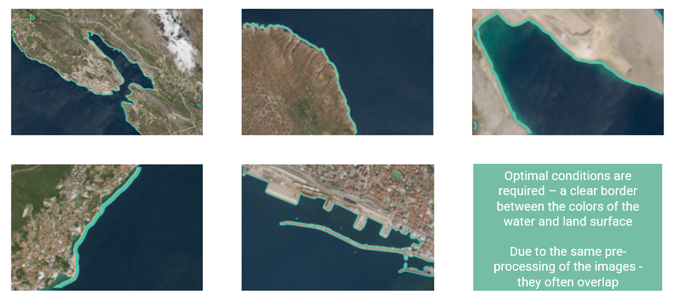
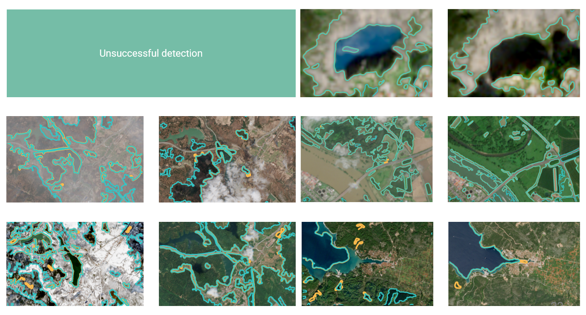
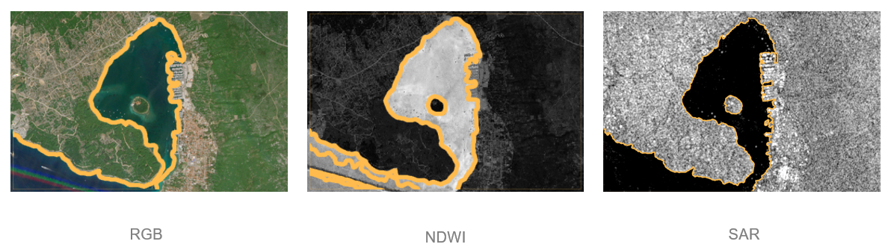
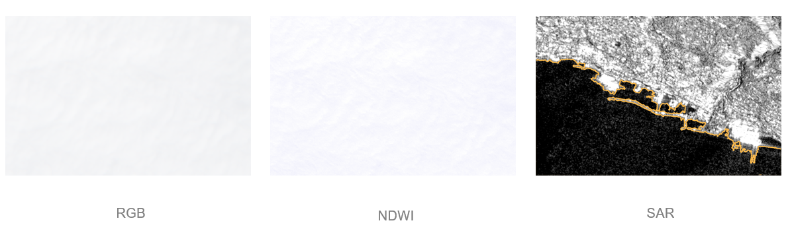
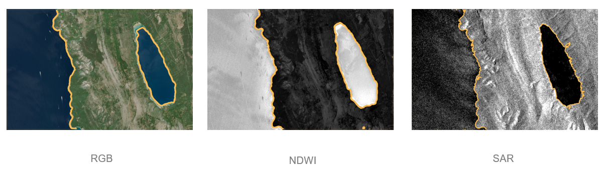

# Detecting water surfaces

- [Detecting water surfaces](#detecting-water-surfaces)
  - [Summary](#summary)
  - [Motivation](#motivation)
  - [Methods](#methods)
  - [Results](#results)
    - [RGB](#rgb)
    - [NDWI](#ndwi)
    - [SAR](#sar)
  - [Publications](#publications)

## Summary

This project started as a Master thesis project and was continued and published as a conference paper as well as extended in the scope for a PhD conference.

The research focus is the automatic detection of water surfaces in satellite imagery using computer vision, specifically digital image processing techniques like blurring, binarization, morphological operations etc.

## Motivation
Detecting water surfaces from satellite imagery can help support environmental monitoring especially in extreme cases such as floods. Automating the detection can help in a faster and more reliable response if needed.

## Methods
The images were downloaded from [Copernicus](https://dataspace.copernicus.eu). The specific dates and times of the images were taken so that the images represent a variety of different environmental conditions such as normal status, droughts, floods, different weather conditions, rivers, lakes and seas. The images come from satellite constellations Sentinel-1 and Sentinel-2 depending on the needed type of the image.

In the research, different image types were used:
- RGB - normal images consisting of red, green and blue channels
- NDWI (Normalized difference water index) - consisting of the green band and the near infrared band used to enhance the water surfaces
- SAR (Synthetic aperture radar) - captures backscatter information using microwave sensors

On all image types, the same methodology was used. The detection of water surface images consists of the following steps:
1. Blurring - reducing noise
2. Binarization - clearer distinction of the objects based on the color threshold used to divide the water from the surroundings
3. Morphological operations - closing noise that is still present because of darker spots in the images
4. Contour detection - using Python OpenCV findContours method

## Results
### RGB
The effectiveness largely depends on ideal weather conditions and the surrounding colors. This is why NDWI was introduced to get a clearer disctinction between the water surfaces and the surroundings.

### NDWI
Since NDWI enhances the water surfaces, the effectiveness depends on weather conditions but slightly less than RGB. This is visible in images with slight fog 2 (d). To reduce the dependency on ideal weather codnitions, SAR was introduced.

[Detecting water surface borders on satellite images](https://ieeexplore.ieee.org/abstract/document/10569332)

### SAR
Unlike RGB and SAR, SAR does not depend on ideal weather conditions or daytime.

Example of detecting the sea from RGB, NDWI and SAR images. The island is a similar greenish color as the sea so it is not getting recognized. The NDWI makes a clear distinction between the land and sea so the detection is successful. The SAR image is the clearest.

During non ideal weather conditions, such as being covered by the clourds, the only method that works is detecting water surfaces on SAR images.

The detection in clear weather conditions and clear distinction between the surrounding colors enables successful detection in all images.

## Publications
[Detecting water surface borders on satellite images](https://ieeexplore.ieee.org/abstract/document/10569332)

[Water Surface Detection Using Multi-Source Sentinel 
Imagery](https://mfc.uniri.hr/wp-content/uploads/2025/09/MFC2025_BoA_final.pdf)